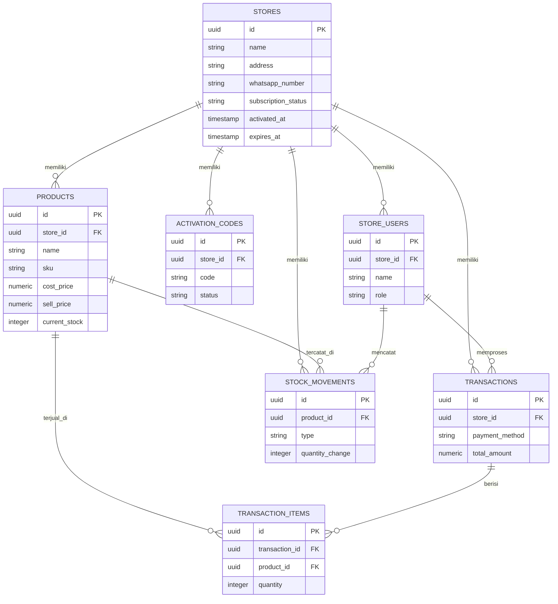

# Skema Database Aplikasi Kasir

Database ini dirancang untuk Supabase (PostgreSQL), dengan pendekatan **multi-tenant**: satu database dipakai oleh semua toko, dipisahkan lewat kolom `store_id` di hampir setiap tabel, dan dijaga oleh **Row Level Security (RLS)** supaya satu toko tidak bisa melihat data toko lain.

---

## Diagram Relasi

---

## Detail Setiap Tabel

### 1. `stores`
Data toko/pengguna aplikasi. Satu baris = satu toko/pelanggan.

| Kolom | Tipe | Keterangan |
|---|---|---|
| id | uuid (PK) | ID unik toko |
| name | text | Nama toko |
| owner_name | text | Nama pemilik |
| address | text | Alamat toko (opsional) |
| whatsapp_number | text | Nomor WhatsApp toko |
| email | text | Email pendaftaran |
| auth_user_id | uuid | Menghubungkan ke akun login Supabase Auth milik owner |
| subscription_status | text | `pending`, `active`, atau `expired` |
| activated_at | timestamp | Tanggal aktivasi pertama kali |
| expires_at | timestamp | Tanggal masa aktif berakhir |
| created_at | timestamp | Tanggal daftar |

### 2. `store_users`
Daftar orang yang bisa login ke satu toko (Owner dan Kasir). Satu toko bisa punya banyak baris di tabel ini.

| Kolom | Tipe | Keterangan |
|---|---|---|
| id | uuid (PK) | ID unik user |
| store_id | uuid (FK) | Toko tempat user ini bekerja |
| auth_user_id | uuid | Menghubungkan ke akun login Supabase Auth |
| name | text | Nama user |
| role | text | `owner` atau `kasir` |
| created_at | timestamp | Tanggal dibuat |

Catatan hak akses (berdasarkan kesepakatan terbaru):
- **Owner**: akses penuh ke semua menu
- **Kasir**: bisa transaksi, kelola produk, stok masuk, dan stok opname — **tidak bisa** membuka laporan atau mengubah info toko/langganan

### 3. `activation_codes`
Riwayat semua kode aktivasi yang pernah dibuat untuk satu toko (aktivasi pertama maupun perpanjangan).

| Kolom | Tipe | Keterangan |
|---|---|---|
| id | uuid (PK) | ID unik |
| store_id | uuid (FK) | Toko pemilik kode ini |
| code | text | Kode aktivasi (unik) |
| status | text | `unused`, `used`, atau `void` |
| generated_at | timestamp | Kapan kode dibuat |
| used_at | timestamp | Kapan kode dipakai (kosong kalau belum dipakai) |
| valid_until | timestamp | Batas waktu kode ini bisa dipakai sebelum hangus (bukan masa aktif toko) |

### 4. `products`
Data produk milik satu toko.

| Kolom | Tipe | Keterangan |
|---|---|---|
| id | uuid (PK) | ID unik produk |
| store_id | uuid (FK) | Toko pemilik produk |
| name | text | Nama produk |
| category | text | Kategori (opsional) |
| unit | text | Satuan (pcs, kg, liter, dan lainnya) |
| sku | text | Kode/barcode produk — **opsional**, boleh kosong |
| cost_price | numeric | Harga beli/modal terakhir |
| sell_price | numeric | Harga jual saat ini |
| current_stock | integer | Jumlah stok saat ini |
| min_stock_alert | integer | Batas minimum sebelum dianggap "stok menipis" |
| image_url | text | Foto produk (opsional) |
| is_active | boolean | Untuk menyembunyikan produk tanpa menghapus datanya |
| created_at | timestamp | Tanggal ditambahkan |

### 5. `stock_movements`
Buku besar semua perubahan stok — baik dari stok masuk, stok opname, maupun pengurangan karena transaksi. Tabel ini yang jadi sumber untuk Laporan Stok.

| Kolom | Tipe | Keterangan |
|---|---|---|
| id | uuid (PK) | ID unik |
| store_id | uuid (FK) | Toko terkait |
| product_id | uuid (FK) | Produk yang berubah stoknya |
| type | text | `stok_masuk`, `opname`, atau `penjualan` |
| quantity_change | integer | Positif untuk penambahan, negatif untuk pengurangan |
| cost_price | numeric | Harga beli saat itu (diisi khusus untuk `stok_masuk`) |
| note | text | Catatan bebas (misalnya nama supplier) |
| created_by | uuid (FK ke store_users) | User yang mencatat perubahan ini |
| created_at | timestamp | Kapan perubahan terjadi |

### 6. `transactions`
Satu baris = satu transaksi penjualan di kasir.

| Kolom | Tipe | Keterangan |
|---|---|---|
| id | uuid (PK) | ID unik transaksi |
| store_id | uuid (FK) | Toko terkait |
| transaction_number | text | Nomor transaksi yang tampil di struk (misalnya TRX-0231) |
| cashier_id | uuid (FK ke store_users) | User yang memproses transaksi ini |
| payment_method | text | `tunai`, `qris`, atau `transfer` |
| total_amount | numeric | Total nilai transaksi |
| status | text | `selesai` atau `dibatalkan` |
| created_at | timestamp | Waktu transaksi |

### 7. `transaction_items`
Daftar produk yang terjual dalam satu transaksi. Satu transaksi bisa punya banyak baris di tabel ini.

| Kolom | Tipe | Keterangan |
|---|---|---|
| id | uuid (PK) | ID unik |
| transaction_id | uuid (FK) | Transaksi terkait |
| product_id | uuid (FK) | Produk yang dibeli |
| product_name | text | Nama produk saat transaksi (disimpan terpisah, supaya struk lama tidak berubah walau nama produk diedit belakangan) |
| quantity | integer | Jumlah yang dibeli |
| price_at_sale | numeric | Harga jual saat transaksi terjadi |
| subtotal | numeric | quantity x price_at_sale |

---

## Kenapa `product_name` dan `price_at_sale` disimpan ulang di `transaction_items`

Ini sengaja disalin dari data produk, bukan mengambil langsung dari tabel `products`. Kalau suatu saat harga jual atau nama produk diubah, struk transaksi yang sudah lewat tidak boleh ikut berubah — histori transaksi harus tetap sesuai dengan yang terjadi saat itu.

---

## Catatan Keamanan Data (Row Level Security)

Setiap tabel yang punya kolom `store_id` akan diberi aturan RLS di Supabase kurang lebih seperti ini:

- User hanya boleh membaca dan mengubah baris yang `store_id`-nya sama dengan toko tempat dia terdaftar di `store_users`
- Untuk menu yang dibatasi khusus Owner (laporan, info toko, langganan), pembatasan dilakukan di aplikasi (bukan di database) dengan mengecek `role` user yang sedang login, karena secara data, seorang Kasir tetap perlu bisa membaca sebagian data yang sama (misalnya harga jual) untuk keperluan transaksi

## Data yang belum dibuatkan tabel khusus

Beberapa hal berikut cukup dihitung otomatis dari tabel yang sudah ada, tidak perlu tabel tambahan:
- **Laporan penjualan dan laba rugi**: dihitung dari `transactions`, `transaction_items`, dan `stock_movements` (untuk harga beli)
- **Laporan kas**: dihitung dari total `transactions` per periode
- **Dashboard**: gabungan ringkasan dari `transactions` hari ini dan `products` yang stoknya di bawah `min_stock_alert`
